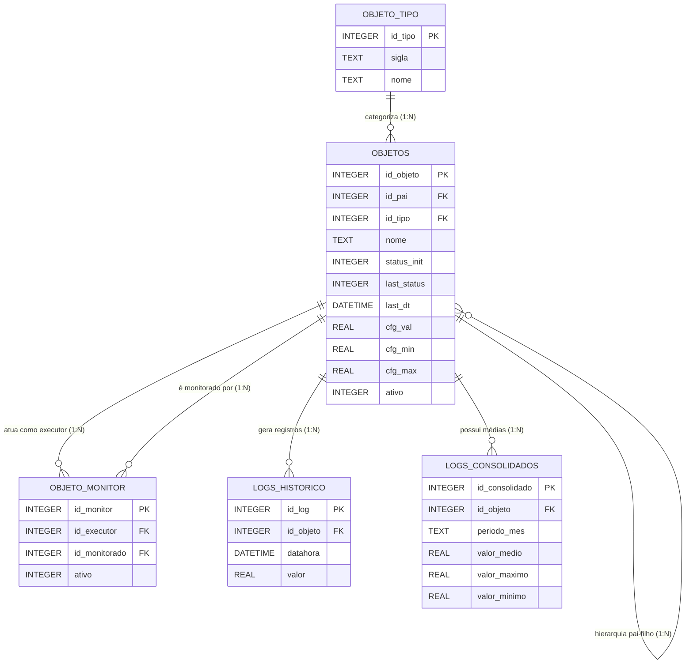

# **Documentação de Arquitetura de Dados (SQLite)**

### **Sistema de Gerenciamento Térmico e Energia**

## **1. Visão Geral**

A transição de logs em arquivos de texto para um banco de dados relacional (SQLite) armazenado no MicroSD proporciona maior integridade, velocidade de consulta pelo WebServer e facilidade na gestão do histórico. O modelo foi desenhado para suportar a alta densidade de sensores e atuadores do rack, garantindo que as leituras sejam rastreáveis, os equipamentos categorizados e o armazenamento otimizado através de regras automatizadas de consolidação e expurgo.

---

## **2. Diagrama de Entidade-Relacionamento (ERD)**

O diagrama abaixo ilustra como os componentes de hardware se relacionam entre si e com a estrutura de monitoramento e logs:




---

## **3. Dicionário de Dados**

### **Tabela: `objeto_tipo**` (Dicionário de Categorias)

| Coluna | Tipo SQLite | Descrição |
| --- | --- | --- |
| `id_tipo` | INTEGER (PK) | Identificador único da categoria. |
| `sigla` | TEXT | Sigla de representação (ex: RL, SC, MF, P). |
| `nome` | TEXT | Nome descritivo (ex: Relé, Sensor Corrente, Pastilha). |

### **Tabela: `objetos**` (Cadastro Principal de Hardware)

| Coluna | Tipo SQLite | Descrição |
| --- | --- | --- |
| `id_objeto` | INTEGER (PK) | Identificador único do item físico. |
| `id_pai` | INTEGER (FK) | Relacionamento hierárquico (um componente dentro de outro). |
| `id_tipo` | INTEGER (FK) | Tipo do objeto (ligado à `objeto_tipo`). |
| `nome` | TEXT | Nome de identificação (ex: "Pastilha Bloco Superior 1"). |
| `status_init` | INTEGER | Status ao ligar o sistema: 1 (Ligado), 0 (Desligado). |
| `last_status` | INTEGER | Último estado conhecido antes do sistema ser desligado. |
| `last_dt` | DATETIME | Data e hora da última alteração de estado. |
| `cfg_val` | REAL | Valor de configuração/setpoint. |
| `cfg_min` | REAL | Limite operacional mínimo. |
| `cfg_max` | REAL | Limite operacional máximo. |
| `dt_cadastro` | DATETIME | Data e hora de criação do registro. |
| `dt_alteracao` | DATETIME | Data e hora da última edição do cadastro. |
| `ativo` | INTEGER | Flag de gerenciamento: 1 (Ativo), 0 (Inativo/Ignorado). |

### **Tabela: `objeto_monitor**` (Regras de Monitoramento)

| Coluna | Tipo SQLite | Descrição |
| --- | --- | --- |
| `id_monitor` | INTEGER (PK) | Identificador único da regra. |
| `id_executor` | INTEGER (FK) | Objeto que toma a ação (ex: Mosfet). |
| `id_monitorado` | INTEGER (FK) | Objeto que é lido (ex: Sensor de Corrente). |
| `dt_cadastro` | DATETIME | Data de criação do vínculo. |
| `dt_alteracao` | DATETIME | Data de alteração do vínculo. |
| `ativo` | INTEGER | Regra ligada (1) ou desligada (0). |

### **Tabela: `logs_historico**` (Registros Brutos)

| Coluna | Tipo SQLite | Descrição |
| --- | --- | --- |
| `id_log` | INTEGER (PK) | Identificador único do registro. |
| `id_objeto` | INTEGER (FK) | Equipamento que gerou o dado. |
| `datahora` | DATETIME | Momento exato da leitura. |
| `valor` | REAL | Métrica capturada pelo sensor/estado do atuador. |

### **Tabela: `logs_consolidados**` (Registros Agrupados Mensalmente)

| Coluna | Tipo SQLite | Descrição |
| --- | --- | --- |
| `id_consolidado` | INTEGER (PK) | Identificador único do agrupamento. |
| `id_objeto` | INTEGER (FK) | Equipamento referente aos dados. |
| `periodo_mes` | TEXT | Mês e ano de referência (formato YYYY-MM). |
| `valor_medio` | REAL | Média aritmética das leituras no período. |
| `valor_maximo` | REAL | Maior valor registrado no período. |
| `valor_minimo` | REAL | Menor valor registrado no período. |

---

### **Tabela: `configuracoes**` (Parâmetros Globais do Sistema)

| Coluna | Tipo SQLite | Descrição |
| --- | --- | --- |
| `id_config` | INTEGER (PK) | Identificador único do parâmetro. |
| `sigla` | TEXT | Chave única usada no código C++ para buscar o valor (Ex: `IP_REDE`). |
| `nome` | TEXT | Nome amigável para exibir no painel do WebServer. |
| `descricao` | TEXT | Explicação detalhada do que este parâmetro faz no sistema. |
| `valor` | TEXT | O valor da configuração (armazenado sempre como texto). |
| `tipo_dado` | TEXT | Como o C++ deve ler o dado: `INT`, `FLOAT`, `STRING` ou `BOOL`. |
| `dt_alteracao` | DATETIME | Data e hora da última modificação feita pelo usuário. |

---

## **4. Scripts de Criação do Banco de Dados (DDL)**

Execute estes comandos na inicialização do sistema para criar as tabelas e índices. A cláusula `IF NOT EXISTS` garante que o banco não será sobrescrito caso já exista no cartão SD.

```sql
-- Ativar suporte a chaves estrangeiras
PRAGMA foreign_keys = ON;

-- 1. Criação das Tabelas
CREATE TABLE IF NOT EXISTS objeto_tipo (
    id_tipo INTEGER PRIMARY KEY AUTOINCREMENT,
    sigla TEXT NOT NULL UNIQUE,
    nome TEXT NOT NULL
);

CREATE TABLE IF NOT EXISTS objetos (
    id_objeto INTEGER PRIMARY KEY AUTOINCREMENT,
    id_pai INTEGER,
    id_tipo INTEGER NOT NULL,
    nome TEXT NOT NULL,
    descricao TEXT,
    status_init INTEGER DEFAULT 0,
    last_status INTEGER,
    last_dt DATETIME,
    cfg_val REAL,
    cfg_min REAL,
    cfg_max REAL,
    dt_cadastro DATETIME DEFAULT CURRENT_TIMESTAMP,
    dt_alteracao DATETIME DEFAULT CURRENT_TIMESTAMP,
    ativo INTEGER DEFAULT 1,
    FOREIGN KEY (id_pai) REFERENCES objetos (id_objeto) ON DELETE SET NULL,
    FOREIGN KEY (id_tipo) REFERENCES objeto_tipo (id_tipo) ON DELETE RESTRICT
);

CREATE TABLE IF NOT EXISTS objeto_monitor (
    id_monitor INTEGER PRIMARY KEY AUTOINCREMENT,
    id_executor INTEGER NOT NULL,
    id_monitorado INTEGER NOT NULL,
    dt_cadastro DATETIME DEFAULT CURRENT_TIMESTAMP,
    dt_alteracao DATETIME DEFAULT CURRENT_TIMESTAMP,
    ativo INTEGER DEFAULT 1,
    FOREIGN KEY (id_executor) REFERENCES objetos (id_objeto) ON DELETE CASCADE,
    FOREIGN KEY (id_monitorado) REFERENCES objetos (id_objeto) ON DELETE CASCADE
);

CREATE TABLE IF NOT EXISTS logs_historico (
    id_log INTEGER PRIMARY KEY AUTOINCREMENT,
    id_objeto INTEGER NOT NULL,
    datahora DATETIME DEFAULT CURRENT_TIMESTAMP,
    valor REAL NOT NULL,
    FOREIGN KEY (id_objeto) REFERENCES objetos (id_objeto) ON DELETE CASCADE
);

CREATE TABLE IF NOT EXISTS logs_consolidados (
    id_consolidado INTEGER PRIMARY KEY AUTOINCREMENT,
    id_objeto INTEGER NOT NULL,
    periodo_mes TEXT NOT NULL,
    valor_medio REAL,
    valor_maximo REAL,
    valor_minimo REAL,
    FOREIGN KEY (id_objeto) REFERENCES objetos (id_objeto) ON DELETE CASCADE
);

-- Tabela para Parâmetros Globais do Sistema
CREATE TABLE IF NOT EXISTS configuracoes (
    id_config INTEGER PRIMARY KEY AUTOINCREMENT,
    sigla TEXT NOT NULL UNIQUE,
    nome TEXT NOT NULL,
    descricao TEXT,
    valor TEXT NOT NULL,
    tipo_dado TEXT NOT NULL,
    dt_alteracao DATETIME DEFAULT CURRENT_TIMESTAMP
);

-- 2. Criação de Índices para Otimizar Buscas
CREATE INDEX IF NOT EXISTS idx_logs_objeto_data ON logs_historico (id_objeto, datahora);
CREATE INDEX IF NOT EXISTS idx_logs_data ON logs_historico (datahora);
CREATE INDEX IF NOT EXISTS idx_consolidados_periodo ON logs_consolidados (periodo_mes);

```

---

## **5. Regras de Manutenção e Performance**

Para manter o banco de dados leve e preservar a vida útil do cartão MicroSD, as rotinas abaixo devem ser executadas periodicamente pelo firmware do ESP32.

### **Regra 1: Consolidação a cada 30 dias**

Transfere os logs brutos mais antigos que 30 dias para a tabela de consolidação, calculando as métricas, e em seguida apaga os dados brutos correspondentes.

```sql
-- Passo A: Inserir dados sumarizados na tabela de consolidação
INSERT INTO logs_consolidados (id_objeto, periodo_mes, valor_medio, valor_maximo, valor_minimo)
SELECT 
    id_objeto, 
    strftime('%Y-%m', datahora) AS periodo_mes, 
    AVG(valor), 
    MAX(valor), 
    MIN(valor)
FROM logs_historico
WHERE datahora <= datetime('now', '-30 days')
GROUP BY id_objeto, strftime('%Y-%m', datahora);

-- Passo B: Apagar os logs brutos que já foram consolidados
DELETE FROM logs_historico 
WHERE datahora <= datetime('now', '-30 days');

```

### **Regra 2: Expurgo após 90 dias**

Apaga os dados consolidados que ultrapassarem a janela de 90 dias, mantendo o histórico de longo prazo enxuto.

```sql
-- Remove logs consolidados onde o mês de referência é mais antigo que 90 dias
DELETE FROM logs_consolidados 
WHERE periodo_mes <= strftime('%Y-%m', datetime('now', '-90 days'));

-- Importante: Após operações de deleção em massa, execute o comando abaixo
-- para desfragmentar o banco de dados e liberar espaço físico no MicroSD.
VACUUM;

```

---

## **6. Insert inicial**

Tabela: **objeto_tipo**
```sql
-- Scripts para popular a tabela objeto_tipo
INSERT INTO objeto_tipo (sigla, nome) VALUES ('SDG'  ,'Sensor do Dreno de Degelo');
INSERT INTO objeto_tipo (sigla, nome) VALUES ('SNL'  ,'Sensor de Nível');
INSERT INTO objeto_tipo (sigla, nome) VALUES ('SCLR' ,'Sensor de Corrente Líquida regrigeração');
INSERT INTO objeto_tipo (sigla, nome) VALUES ('SCDC' ,'Sensor de Corrente DC');
INSERT INTO objeto_tipo (sigla, nome) VALUES ('SCAC' ,'Sensor de Corrente AC');
INSERT INTO objeto_tipo (sigla, nome) VALUES ('STA'  ,'Sensor de Temperatura Ar');
INSERT INTO objeto_tipo (sigla, nome) VALUES ('CL'   ,'Cooler (Geral)');
INSERT INTO objeto_tipo (sigla, nome) VALUES ('CLCOL','Cooler (Ar Frio)');
INSERT INTO objeto_tipo (sigla, nome) VALUES ('CLHOT','Cooler (Ar Quente)');
INSERT INTO objeto_tipo (sigla, nome) VALUES ('MF'   ,'MOSFET');
INSERT INTO objeto_tipo (sigla, nome) VALUES ('RL'   ,'Relé');
INSERT INTO objeto_tipo (sigla, nome) VALUES ('PP'   ,'Pastilha Peltier');
INSERT INTO objeto_tipo (sigla, nome) VALUES ('SAM'   ,'Sensor de abertura magnético');
```

Tabela: **objetos**
```sql
-- Scripts para popular a tabela objetos
INSERT INTO objetos (nome, descricao, id_tipo, status_init, last_status, last_dt, cfg_val, cfg_min, cfg_max, dt_cadastro, dt_alteracao, ativo) VALUES ('Mosfete00',''                          , 1 , 0    , NULL, NULL, 1000, 0, 100, datetime('now'), NULL, 1);
INSERT INTO objetos (nome, descricao, id_tipo, status_init, last_status, last_dt, cfg_val, cfg_min, cfg_max, dt_cadastro, dt_alteracao, ativo) VALUES ('Mosfete01',''                          , 1 , 0    , NULL, NULL, 1000, 0, 100, datetime('now'), NULL, 1);
INSERT INTO objetos (nome, descricao, id_tipo, status_init, last_status, last_dt, cfg_val, cfg_min, cfg_max, dt_cadastro, dt_alteracao, ativo) VALUES ('Mosfete02',''                          , 1 , 0    , NULL, NULL, 1000, 0, 100, datetime('now'), NULL, 1);
INSERT INTO objetos (nome, descricao, id_tipo, status_init, last_status, last_dt, cfg_val, cfg_min, cfg_max, dt_cadastro, dt_alteracao, ativo) VALUES ('Mosfete03',''                          , 1 , 0    , NULL, NULL, 1000, 0, 100, datetime('now'), NULL, 1);
INSERT INTO objetos (nome, descricao, id_tipo, status_init, last_status, last_dt, cfg_val, cfg_min, cfg_max, dt_cadastro, dt_alteracao, ativo) VALUES ('Mosfete04',''                          , 1 , 0    , NULL, NULL, 1000, 0, 100, datetime('now'), NULL, 1);
INSERT INTO objetos (nome, descricao, id_tipo, status_init, last_status, last_dt, cfg_val, cfg_min, cfg_max, dt_cadastro, dt_alteracao, ativo) VALUES ('Mosfete05',''                          , 1 , 0    , NULL, NULL, 1000, 0, 100, datetime('now'), NULL, 1);
INSERT INTO objetos (nome, descricao, id_tipo, status_init, last_status, last_dt, cfg_val, cfg_min, cfg_max, dt_cadastro, dt_alteracao, ativo) VALUES ('Mosfete06',''                          , 1 , 0    , NULL, NULL, 1000, 0, 100, datetime('now'), NULL, 1);
INSERT INTO objetos (nome, descricao, id_tipo, status_init, last_status, last_dt, cfg_val, cfg_min, cfg_max, dt_cadastro, dt_alteracao, ativo) VALUES ('Mosfete07',''                          , 1 , 0    , NULL, NULL, 1000, 0, 100, datetime('now'), NULL, 1);
INSERT INTO objetos (nome, descricao, id_tipo, status_init, last_status, last_dt, cfg_val, cfg_min, cfg_max, dt_cadastro, dt_alteracao, ativo) VALUES ('Mosfete08',''                          , 1 , 0    , NULL, NULL, 1000, 0, 100, datetime('now'), NULL, 1);
INSERT INTO objetos (nome, descricao, id_tipo, status_init, last_status, last_dt, cfg_val, cfg_min, cfg_max, dt_cadastro, dt_alteracao, ativo) VALUES ('Mosfete09',''                          , 1 , 0    , NULL, NULL, 1000, 0, 100, datetime('now'), NULL, 1);
INSERT INTO objetos (nome, descricao, id_tipo, status_init, last_status, last_dt, cfg_val, cfg_min, cfg_max, dt_cadastro, dt_alteracao, ativo) VALUES ('Mosfete10',''                          , 1 , 0    , NULL, NULL, 1000, 0, 100, datetime('now'), NULL, 1);


INSERT INTO objetos (nome, descricao, id_tipo, status_init, last_status, last_dt, cfg_val, cfg_min, cfg_max, dt_cadastro, dt_alteracao, ativo) VALUES ('','Relé'                            , 2 , 0    , NULL, NULL, NULL, 0, 100, datetime('now'), NULL, 1);
INSERT INTO objetos (nome, descricao, id_tipo, status_init, last_status, last_dt, cfg_val, cfg_min, cfg_max, dt_cadastro, dt_alteracao, ativo) VALUES ('','Pastilha Peltier'                , 3 , 0    , NULL, NULL, 30  , 0, 100, datetime('now'), NULL, 1);
INSERT INTO objetos (nome, descricao, id_tipo, status_init, last_status, last_dt, cfg_val, cfg_min, cfg_max, dt_cadastro, dt_alteracao, ativo) VALUES ('','Dreno do Degelo'                 , 4  , NULL , NULL, NULL, NULL, 0, 100, datetime('now'), NULL, 1);
INSERT INTO objetos (nome, descricao, id_tipo, status_init, last_status, last_dt, cfg_val, cfg_min, cfg_max, dt_cadastro, dt_alteracao, ativo) VALUES ('','Cooler'                          , 10  , 0    , NULL, NULL, 30  , 0, 100, datetime('now'), NULL, 1);
INSERT INTO objetos (nome, descricao, id_tipo, status_init, last_status, last_dt, cfg_val, cfg_min, cfg_max, dt_cadastro, dt_alteracao, ativo) VALUES ('','Cooler ar quente'                , 12  , 0    , NULL, NULL, 30  , 0, 100, datetime('now'), NULL, 1);
INSERT INTO objetos (nome, descricao, id_tipo, status_init, last_status, last_dt, cfg_val, cfg_min, cfg_max, dt_cadastro, dt_alteracao, ativo) VALUES ('','Cooler ar frio'                  , 11  , 0    , NULL, NULL, 30  , 0, 100, datetime('now'), NULL, 1);


INSERT INTO objetos (nome, descricao, id_tipo, status_init, last_status, last_dt, cfg_val, cfg_min, cfg_max, dt_cadastro, dt_alteracao, ativo) VALUES ('SARF','Sainda de ar frio'      						 , 9  , 0    , NULL, NULL, 30  , 0, 100, datetime('now'), NULL, 1);
INSERT INTO objetos (nome, descricao, id_tipo, status_init, last_status, last_dt, cfg_val, cfg_min, cfg_max, dt_cadastro, dt_alteracao, ativo) VALUES ('TPDF','Termômetro porta da frente'      			 , 9  , 0    , NULL, NULL, 30  , 0, 100, datetime('now'), NULL, 1);
INSERT INTO objetos (nome, descricao, id_tipo, status_init, last_status, last_dt, cfg_val, cfg_min, cfg_max, dt_cadastro, dt_alteracao, ativo) VALUES ('EARQ','Entrata de ar Quente'      					 , 9  , 0    , NULL, NULL, 30  , 0, 100, datetime('now'), NULL, 1);
INSERT INTO objetos (nome, descricao, id_tipo, status_init, last_status, last_dt, cfg_val, cfg_min, cfg_max, dt_cadastro, dt_alteracao, ativo) VALUES ('TPDT','Termômetro porta de trás'      				 , 9  , 0    , NULL, NULL, 30  , 0, 100, datetime('now'), NULL, 1);
INSERT INTO objetos (nome, descricao, id_tipo, status_init, last_status, last_dt, cfg_val, cfg_min, cfg_max, dt_cadastro, dt_alteracao, ativo) VALUES ('TDCE','Termômetro dissipador de calor esquerdo'      , 9  , 0    , NULL, NULL, 30  , 0, 100, datetime('now'), NULL, 1);
INSERT INTO objetos (nome, descricao, id_tipo, status_init, last_status, last_dt, cfg_val, cfg_min, cfg_max, dt_cadastro, dt_alteracao, ativo) VALUES ('TDCD','Termômetro dissipador de calor direito'       , 9  , 0    , NULL, NULL, 30  , 0, 100, datetime('now'), NULL, 1);


INSERT INTO objetos (nome, descricao, id_tipo, status_init, last_status, last_dt, cfg_val, cfg_min, cfg_max, dt_cadastro, dt_alteracao, ativo) VALUES ('','Sensor de Corrente Elétrica DC' , 7  , 0    , NULL, NULL, 30  , 0, 100, datetime('now'), NULL, 1);
INSERT INTO objetos (nome, descricao, id_tipo, status_init, last_status, last_dt, cfg_val, cfg_min, cfg_max, dt_cadastro, dt_alteracao, ativo) VALUES ('','Sensor de Corrente Elétrica AC' , 8  , 0    , NULL, NULL, 30  , 0, 100, datetime('now'), NULL, 1);
INSERT INTO objetos (nome, descricao, id_tipo, status_init, last_status, last_dt, cfg_val, cfg_min, cfg_max, dt_cadastro, dt_alteracao, ativo) VALUES ('','Sensor de Corrente Líquida'    , 6  , 0    , NULL, NULL, 30  , 0, 100, datetime('now'), NULL, 1);
INSERT INTO objetos (nome, descricao, id_tipo, status_init, last_status, last_dt, cfg_val, cfg_min, cfg_max, dt_cadastro, dt_alteracao, ativo) VALUES ('','Sensor de Nível'               , 5  , 0    , NULL, NULL, 30  , 0, 100, datetime('now'), NULL, 1);


```

Tabela: **objeto_monitor**
```sql
-- Scripts para popular a tabela objeto_tipo
INSERT INTO objeto_monitor (id_executor, id_monitorado) VALUES (1, 11);
```

Tabela: **configuracoes**
```sql
-- Configuração de Rede (Lido pelo start_ethernet.cpp)
INSERT INTO configuracoes (sigla, nome, descricao, valor, tipo_dado) 
VALUES ('REDE_IP', 'Endereço IP Fixo', 'IP fixo da placa na rede local Ethernet', '192.168.10.210', 'STRING');

INSERT INTO configuracoes (sigla, nome, descricao, valor, tipo_dado) 
VALUES ('REDE_MASCARA', 'Máscara de Sub-rede', 'Máscara da rede local', '255.255.255.0', 'STRING');

-- Configurações de Banco de Dados e Logs (Lido pela rotina principal)
INSERT INTO configuracoes (sigla, nome, descricao, valor, tipo_dado) 
VALUES ('LOG_INTERVALO', 'Intervalo de Gravação de Log', 'Tempo em milissegundos entre as leituras dos sensores', '5000', 'INT');

INSERT INTO configuracoes (sigla, nome, descricao, valor, tipo_dado) 
VALUES ('DB_DIAS_CONSOL', 'Dias para Consolidação', 'Idade dos logs em dias para gerar as médias', '30', 'INT');

INSERT INTO configuracoes (sigla, nome, descricao, valor, tipo_dado) 
VALUES ('DB_DIAS_EXPURGO', 'Dias para Expurgo', 'Idade dos logs consolidados em dias para exclusão definitiva', '90', 'INT');

-- Configurações Térmicas Globais
INSERT INTO configuracoes (sigla, nome, descricao, valor, tipo_dado) 
VALUES ('TEMP_ALERTA', 'Temperatura de Alerta', 'Temperatura em °C para disparar aviso no WebServer', '35.5', 'FLOAT');

INSERT INTO configuracoes (sigla, nome, descricao, valor, tipo_dado) 
VALUES ('SISTEMA_ATIVO', 'Status Geral do Gerenciador', 'Chave mestre para ativar ou pausar o monitoramento do rack (1=Ativo, 0=Pausado)', '1', 'BOOL');

```

Tabela: **monitor_tab_automaticas**
Esta query vai popular a tabela com valores de log para execução de teste.
```sql
INSERT INTO monitor_STA_SARF (id_objeto, datahora, objeto, valor)
WITH RECURSIVE
  -- 1. Cria o loop de datas do dia 01/03/2026 até 31/03/2026
  gerador_datas(dt) AS (
    SELECT '2026-03-01 00:00:00'
    UNION ALL
    -- Altere '+1 hour' para '+15 minute' ou '+1 minute' se quiser mais volume de dados
    SELECT datetime(dt, '+1 minute') 
    FROM gerador_datas
    WHERE dt < '2026-03-31 23:00:00'
  )
-- 2. Insere os dados aplicando as regras de temperatura e horário
SELECT 
  1 AS id_objeto,
  dt AS datahora,
  'SARF' AS objeto,
  CASE 
    -- Se a hora for entre 09:00 e 18:00 (Pico de Calor)
    -- Gera valor aleatório entre 25 e 50 graus
    WHEN CAST(strftime('%H', dt) AS INTEGER) BETWEEN 9 AND 18 
    THEN ABS(RANDOM() % 26) + 25 
    
    -- Fora desse horário (Madrugada/Noite)
    -- Gera valor aleatório entre 7 e 24 graus
    ELSE ABS(RANDOM() % 18) + 7  
  END AS valor
FROM gerador_datas;

```