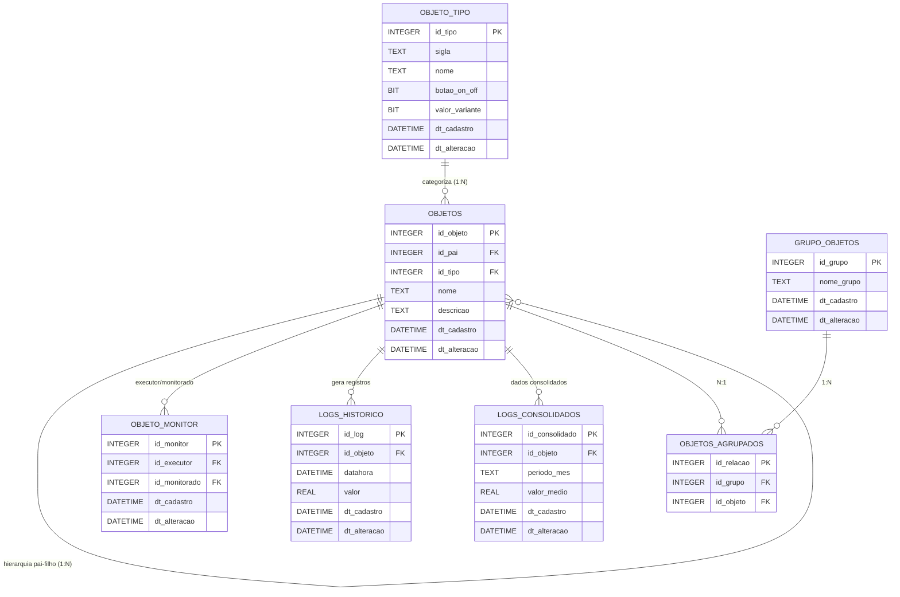
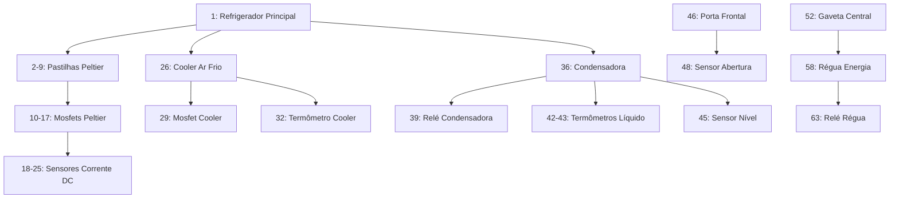

# **Documentação de Arquitetura de Dados (SQLite)**

### **Sistema de Gerenciamento Térmico e Energia**

## **1. Visão Geral**

A transição de logs em arquivos de texto para um banco de dados relacional (SQLite) armazenado no MicroSD proporciona maior integridade, velocidade de consulta pelo WebServer e facilidade na gestão do histórico. O modelo foi desenhado para suportar a alta densidade de sensores e atuadores do rack, garantindo que as leituras sejam rastreáveis, os equipamentos categorizados e o armazenamento otimizado através de regras automatizadas de consolidação e expurgo.

---

## **2. Diagrama de Entidade-Relacionamento (ERD)**

O diagrama abaixo ilustra como os componentes de hardware se relacionam entre si e com a estrutura de monitoramento e logs:




### **Diagrama de Ligação de Registros (Hierarquia Física `id_pai`)**
Este diagrama ilustra a árvore de dependência criada através do campo `id_pai` na tabela `objetos`. Ele mostra como a energia ou a lógica de controle flui de um componente principal (Refrigerador) até seus microcomponentes (Mosfets e Sensores).




---

## **3. Dicionário de Dados**

### **Tabela: `objeto_tipo`**
| Coluna | Tipo SQLite | Descrição |
| :--- | :--- | :--- |
| `id_tipo` | INTEGER (PK) | Identificador único da categoria. |
| `sigla` | TEXT | Sigla de representação (ex: RL, SC). |
| `nome` | TEXT | Nome descritivo (ex: Relé, Sensor Corrente). |
| `botao_on_off` | BIT | 1 se o WebServer deve renderizar um botão (liga/desliga). |
| `valor_variante` | BIT | 1 se o componente permite controle variável (ex: PWM). |

### **Tabela: `objetos`**
| Coluna | Tipo SQLite | Descrição |
| :--- | :--- | :--- |
| `id_objeto` | INTEGER (PK) | Identificador único do item físico. |
| `id_pai` | INTEGER (FK) | Relacionamento hierárquico (um componente dentro ou subordinado a outro). |
| `id_tipo` | INTEGER (FK) | Tipo do objeto (ligado à `objeto_tipo`). |
| `nome` | TEXT | Nome de identificação (ex: "Pastilha Bloco 1"). |
| `descricao` | TEXT | Detalhamento sobre a função física do objeto. |
| `modelos_circuito` | TEXT | Nome/código do circuito físico atrelado. |
| `modelos_circuito_foto` | TEXT | Caminho da imagem esquemática no `/data` do SD. |
| `imagem` | TEXT | Imagem representativa do hardware. |
| `status_init` | INTEGER | Status ao ligar o sistema: 1 (Ligado), 0 (Desligado). |
| `cfg_val`, `cfg_min`, `cfg_max` | REAL | Setpoints e limites operacionais da peça. |
| `ativo` | INTEGER | Flag de gerenciamento: 1 (Ativo), 0 (Inativo). |


### **Tabela: `objeto_monitor`** (Regras de Monitoramento)

| Coluna | Tipo SQLite | Descrição |
| --- | --- | --- |
| `id_monitor` | INTEGER (PK) | Identificador único da regra. |
| `id_executor` | INTEGER (FK) | Objeto que toma a ação (ex: Mosfet). |
| `id_monitorado` | INTEGER (FK) | Objeto que é lido (ex: Sensor de Corrente). |
| `dt_cadastro` | DATETIME | Data de criação do vínculo. |
| `dt_alteracao` | DATETIME | Data de alteração do vínculo. |
| `ativo` | INTEGER | Regra ligada (1) ou desligada (0). |

### **Tabela: `logs_historico`** (Registros Brutos)

| Coluna | Tipo SQLite | Descrição |
| --- | --- | --- |
| `id_log` | INTEGER (PK) | Identificador único do registro. |
| `id_objeto` | INTEGER (FK) | Equipamento que gerou o dado. |
| `datahora` | DATETIME | Momento exato da leitura. |
| `valor` | REAL | Métrica capturada pelo sensor/estado do atuador. |

### **Tabela: `logs_consolidados`** (Registros Agrupados Mensalmente)

| Coluna | Tipo SQLite | Descrição |
| --- | --- | --- |
| `id_consolidado` | INTEGER (PK) | Identificador único do agrupamento. |
| `id_objeto` | INTEGER (FK) | Equipamento referente aos dados. |
| `periodo_mes` | TEXT | Mês e ano de referência (formato YYYY-MM). |
| `valor_medio` | REAL | Média aritmética das leituras no período. |
| `valor_maximo` | REAL | Maior valor registrado no período. |
| `valor_minimo` | REAL | Menor valor registrado no período. |


### **Tabela: `configuracoes`** (Parâmetros Globais do Sistema)

| Coluna | Tipo SQLite | Descrição |
| --- | --- | --- |
| `id_config` | INTEGER (PK) | Identificador único do parâmetro. |
| `sigla` | TEXT | Chave única usada no código C++ para buscar o valor (Ex: `IP_REDE`). |
| `nome` | TEXT | Nome amigável para exibir no painel do WebServer. |
| `descricao` | TEXT | Explicação detalhada do que este parâmetro faz no sistema. |
| `valor` | TEXT | O valor da configuração (armazenado sempre como texto). |
| `tipo_dado` | TEXT | Como o C++ deve ler o dado: `INT`, `FLOAT`, `STRING` ou `BOOL`. |
| `dt_alteracao` | DATETIME | Data e hora da última modificação feita pelo usuário. |


### **Tabela: `grupo_objetos`** (Grupo do objetos)
Tabela responsável por agrupar múltiplos objetos para execução de ações em lote.

Função:
- Permitir controle simultâneo de vários dispositivos
- Abstrair operações complexas (ex: ligar toda refrigeração)

Observação:
- O relacionamento correto é N:N através da tabela objetos_agrupados

| Coluna | Tipo SQLite | Descrição |
| --- | --- | --- |
| `id_grupo_objetos` | INTEGER (PK) | Identificador único do grupo. |
| `id_objeto` | INTEGER (FK) | Equipamento referente aos dados. |
| `nome_grupo` | TEXT | Nome do grupo. |
| `descricao` | TEXT | Explicação detalhada do que este parâmetro faz no sistema. |
| `valor` | TEXT | O valor da configuração (armazenado sempre como texto). |
| `tipo_dado` | TEXT | Como o C++ deve ler o dado: `INT`, `FLOAT`, `STRING` ou `BOOL`. |
| `dt_alteracao` | DATETIME | Data e hora da última modificação feita pelo usuário. |

---

## **4. Scripts de Criação do Banco de Dados (DDL)**

Execute estes comandos na inicialização do sistema para criar as tabelas e índices. A cláusula `IF NOT EXISTS` garante que o banco não será sobrescrito caso já exista no cartão SD.

```sql
-- Ativar suporte a chaves estrangeiras
PRAGMA foreign_keys = ON;

-- 1. Criação das Tabelas
CREATE TABLE IF NOT EXISTS objeto_tipo (
    id_tipo INTEGER PRIMARY KEY AUTOINCREMENT,
    sigla TEXT NOT NULL UNIQUE,
    nome TEXT NOT NULL,
    botao_on_off BIT DEFAULT 0,
    valor_variante BIT DEFAULT 0,
    dt_cadastro DATETIME DEFAULT CURRENT_TIMESTAMP,
    dt_alteracao DATETIME DEFAULT CURRENT_TIMESTAMP    
);

CREATE TABLE IF NOT EXISTS objetos (
    id_objeto INTEGER PRIMARY KEY AUTOINCREMENT,
    id_pai INTEGER,
    id_tipo INTEGER NOT NULL,
    nome TEXT NOT NULL,
    descricao TEXT,
    modelos_circuito TEXT,
    modelos_circuito_foto TEXT,
    imagem TEXT,
    status_init INTEGER DEFAULT 0,
    last_status INTEGER,
    last_dt DATETIME,
    cfg_val REAL,
    cfg_min REAL,
    cfg_max REAL,
    dt_cadastro DATETIME DEFAULT CURRENT_TIMESTAMP,
    dt_alteracao DATETIME DEFAULT CURRENT_TIMESTAMP,
    ativo INTEGER DEFAULT 1,
    FOREIGN KEY (id_pai) REFERENCES objetos (id_objeto) ON DELETE SET NULL,
    FOREIGN KEY (id_tipo) REFERENCES objeto_tipo (id_tipo) ON DELETE RESTRICT
);

CREATE TABLE IF NOT EXISTS objeto_monitor (
    id_monitor INTEGER PRIMARY KEY AUTOINCREMENT,
    id_executor INTEGER NOT NULL,
    id_monitorado INTEGER NOT NULL,
    dt_cadastro DATETIME DEFAULT CURRENT_TIMESTAMP,
    dt_alteracao DATETIME DEFAULT CURRENT_TIMESTAMP,
    ativo INTEGER DEFAULT 1,
    FOREIGN KEY (id_executor) REFERENCES objetos (id_objeto) ON DELETE CASCADE,
    FOREIGN KEY (id_monitorado) REFERENCES objetos (id_objeto) ON DELETE CASCADE
);

CREATE TABLE IF NOT EXISTS logs_historico (
    id_log INTEGER PRIMARY KEY AUTOINCREMENT,
    id_objeto INTEGER NOT NULL,
    datahora DATETIME DEFAULT CURRENT_TIMESTAMP,
    valor REAL NOT NULL,
    dt_cadastro DATETIME DEFAULT CURRENT_TIMESTAMP,
    dt_alteracao DATETIME DEFAULT CURRENT_TIMESTAMP,    
    FOREIGN KEY (id_objeto) REFERENCES objetos (id_objeto) ON DELETE CASCADE
);

CREATE TABLE IF NOT EXISTS logs_consolidados (
    id_consolidado INTEGER PRIMARY KEY AUTOINCREMENT,
    id_objeto INTEGER NOT NULL,
    periodo_mes TEXT NOT NULL,
    valor_medio REAL,
    valor_maximo REAL,
    valor_minimo REAL,
    dt_cadastro DATETIME DEFAULT CURRENT_TIMESTAMP,
    dt_alteracao DATETIME DEFAULT CURRENT_TIMESTAMP,    
    FOREIGN KEY (id_objeto) REFERENCES objetos (id_objeto) ON DELETE CASCADE
);

-- Tabela para Parâmetros Globais do Sistema
CREATE TABLE IF NOT EXISTS configuracoes (
    id_config INTEGER PRIMARY KEY AUTOINCREMENT,
    sigla TEXT NOT NULL UNIQUE,
    nome TEXT NOT NULL,
    descricao TEXT,
    valor TEXT NOT NULL,
    tipo_dado TEXT NOT NULL,
    dt_cadastro DATETIME DEFAULT CURRENT_TIMESTAMP,
    dt_alteracao DATETIME DEFAULT CURRENT_TIMESTAMP
);


-- Criação da Tabela 1: grupo_objetos
CREATE TABLE grupo_objetos (
    id_grupos_objetos INTEGER PRIMARY KEY AUTOINCREMENT,
    id_objeto INTEGER,
    nome_grupo TEXT,
    FOREIGN KEY (id_objeto) REFERENCES objeto (id_objeto)
);

-- Criação da Tabela 2: objetos_agrupados
CREATE TABLE objetos_agrupados (
    id_objetos_agrupados INTEGER PRIMARY KEY AUTOINCREMENT,
    id_grupos_objetos INTEGER,
    id_objeto INTEGER,
    FOREIGN KEY (id_grupos_objetos) REFERENCES grupo_objetos (id_grupos_objetos),
    FOREIGN KEY (id_objeto) REFERENCES objeto (id_objeto)
);

-- 2. Criação de Índices para Otimizar Buscas
CREATE INDEX IF NOT EXISTS idx_logs_objeto_data ON logs_historico (id_objeto, datahora);
CREATE INDEX IF NOT EXISTS idx_logs_data ON logs_historico (datahora);
CREATE INDEX IF NOT EXISTS idx_consolidados_periodo ON logs_consolidados (periodo_mes);

```

### **Tabelas de Log do monitoramento dos sensores:**
As tabelas de monitoramentos do sensores serão criadas automaticamentes com base nos registros da tabelas **objeto_monitor**, as colunas **id_executor** representan o sensor que vai gravar os dados na tabela, a coluna **id_monitorado** será o objeto que é monitorado pelo sensor.

Esta tarefas são executadas pela placa ESP32 no arquivo **start_sd.cpp**

```C#
void criarTabelasDeMonitoramento(sqlite3* db) {
    const char* sqlBusca = 
        "SELECT DISTINCT t.sigla, REPLACE(e.nome, ' ', '_') AS nome_limpo "
        "FROM objeto_monitor m "
        "JOIN objetos e ON m.id_executor = e.id_objeto "
        "JOIN objeto_tipo t ON e.id_tipo = t.id_tipo "
        "WHERE m.ativo = 1;";

    sqlite3_stmt* stmt;
    
    // Prepara a consulta
    if (sqlite3_prepare_v2(db, sqlBusca, -1, &stmt, NULL) == SQLITE_OK) {
        
        // Itera sobre todos os executores encontrados
        while (sqlite3_step(stmt) == SQLITE_ROW) {
            const unsigned char* sigla = sqlite3_column_text(stmt, 0);
            const unsigned char* nome = sqlite3_column_text(stmt, 1);
            
            // Monta o nome da tabela dinamicamente: monitor_SIGLA_NOME
            std::string nomeTabela = "monitor_" + std::string((const char*)sigla) + "_" + std::string((const char*)nome);
            
            // Monta o comando CREATE TABLE
            std::string sqlCreate = 
                "CREATE TABLE IF NOT EXISTS " + nomeTabela + " ("
                "id INTEGER PRIMARY KEY AUTOINCREMENT, "
                "id_objeto INTEGER, "
                "datahora DATETIME DEFAULT CURRENT_TIMESTAMP, "
                "objeto TEXT, "
                "valor REAL, "
                "FOREIGN KEY (id_objeto) REFERENCES objetos (id_objeto) ON DELETE CASCADE"
                ");";
            
            // Executa a criação da tabela
            char* errMsg = nullptr;
            if (sqlite3_exec(db, sqlCreate.c_str(), 0, 0, &errMsg) != SQLITE_OK) {
                Serial.printf("SQLite: Erro ao criar tabela %s: %s\n", nomeTabela.c_str(), errMsg);
                sqlite3_free(errMsg);
            } else {
                Serial.printf("SQLite: Tabela %s verificada/criada com sucesso.\n", nomeTabela.c_str());
            }
        }
    } else {
        Serial.println("SQLite: Erro ao preparar a consulta de monitores ativos.");
    }
    sqlite3_finalize(stmt);
}


```

---


---

## 🔎 Funcionamento dos Logs

### logs_historico
Armazena dados brutos de alta frequência gerados pelos sensores.
- Alta volumetria
- Base para consolidação

### logs_consolidados
Armazena dados agregados mensalmente:
- Média
- Máximo
- Mínimo

### Fluxo
logs_historico → consolidação (30 dias) → logs_consolidados → expurgo (90 dias)

Objetivo:
- Reduzir uso de armazenamento
- Melhorar performance de consulta

## **5. Regras de Manutenção e Performance**

Para manter o banco de dados leve e preservar a vida útil do cartão MicroSD, as rotinas abaixo devem ser executadas periodicamente pelo firmware do ESP32.

### **Regra 1: Consolidação a cada 30 dias**

Transfere os logs brutos mais antigos que 30 dias para a tabela de consolidação, calculando as métricas, e em seguida apaga os dados brutos correspondentes.

```sql
-- Passo A: Inserir dados sumarizados na tabela de consolidação
INSERT INTO logs_consolidados (id_objeto, periodo_mes, valor_medio, valor_maximo, valor_minimo)
SELECT 
    id_objeto, 
    strftime('%Y-%m', datahora) AS periodo_mes, 
    AVG(valor), 
    MAX(valor), 
    MIN(valor)
FROM logs_historico
WHERE datahora <= datetime('now', '-30 days')
GROUP BY id_objeto, strftime('%Y-%m', datahora);

-- Passo B: Apagar os logs brutos que já foram consolidados
DELETE FROM logs_historico 
WHERE datahora <= datetime('now', '-30 days');

```

### **Regra 2: Expurgo após 90 dias**

Apaga os dados consolidados que ultrapassarem a janela de 90 dias, mantendo o histórico de longo prazo enxuto.

```sql
-- Remove logs consolidados onde o mês de referência é mais antigo que 90 dias
DELETE FROM logs_consolidados 
WHERE periodo_mes <= strftime('%Y-%m', datetime('now', '-90 days'));

-- Importante: Após operações de deleção em massa, execute o comando abaixo
-- para desfragmentar o banco de dados e liberar espaço físico no MicroSD.
VACUUM;

```

---

## **6. Insert inicial**

### 

Tabela: **objeto_tipo**
```sql
-- Scripts para popular a tabela objeto_tipo
INSERT INTO objeto_tipo (sigla, nome, botao_on_off, valor_variante) VALUES ('SDG'  ,'Sensor do Dreno de Degelo',1,0);
INSERT INTO objeto_tipo (sigla, nome, botao_on_off, valor_variante) VALUES ('SNL'  ,'Sensor de Nível',1,0);
INSERT INTO objeto_tipo (sigla, nome, botao_on_off, valor_variante) VALUES ('SCLR' ,'Sensor de Corrente Líquida regrigeração',1,0);
INSERT INTO objeto_tipo (sigla, nome, botao_on_off, valor_variante) VALUES ('SCDC' ,'Sensor de Corrente DC',1,0);
INSERT INTO objeto_tipo (sigla, nome, botao_on_off, valor_variante) VALUES ('SCAC' ,'Sensor de Corrente AC',1,0);
INSERT INTO objeto_tipo (sigla, nome, botao_on_off, valor_variante) VALUES ('STA'  ,'Sensor de Temperatura AR',1,0);
INSERT INTO objeto_tipo (sigla, nome, botao_on_off, valor_variante) VALUES ('STL'  ,'Sensor de Temperatura Liquido',1,0);
INSERT INTO objeto_tipo (sigla, nome, botao_on_off, valor_variante) VALUES ('RF'   ,'Refrigerador',1,1);
INSERT INTO objeto_tipo (sigla, nome, botao_on_off, valor_variante) VALUES ('CODR' ,'Condensadora',1,0);
INSERT INTO objeto_tipo (sigla, nome, botao_on_off, valor_variante) VALUES ('CL'   ,'Cooler',1,1);
INSERT INTO objeto_tipo (sigla, nome, botao_on_off, valor_variante) VALUES ('MF'   ,'MOSFET',1,1);
INSERT INTO objeto_tipo (sigla, nome, botao_on_off, valor_variante) VALUES ('RL'   ,'Relé',1,0);
INSERT INTO objeto_tipo (sigla, nome, botao_on_off, valor_variante) VALUES ('PP'   ,'Pastilha Peltier',1,1);
INSERT INTO objeto_tipo (sigla, nome, botao_on_off, valor_variante) VALUES ('GAV'  ,'Gaveta',0,0);
INSERT INTO objeto_tipo (sigla, nome, botao_on_off, valor_variante) VALUES ('PRT'  ,'Porta',0,0);
INSERT INTO objeto_tipo (sigla, nome, botao_on_off, valor_variante) VALUES ('DEG'  ,'Distribuidor de energia',1,0);
INSERT INTO objeto_tipo (sigla, nome, botao_on_off, valor_variante) VALUES ('NBK'  ,'Nobreak',1,0);
INSERT INTO objeto_tipo (sigla, nome, botao_on_off, valor_variante) VALUES ('BBT'  ,'Banco de baterias',1,0);
INSERT INTO objeto_tipo (sigla, nome, botao_on_off, valor_variante) VALUES ('ETZ'  ,'Estabilizador',1,0);
INSERT INTO objeto_tipo (sigla, nome, botao_on_off, valor_variante) VALUES ('SM'  ,'Sensor magnético',1,0);
INSERT INTO objeto_tipo (sigla, nome, botao_on_off, valor_variante) VALUES ('ESP32P4CMGT'  ,'Controlador Manager Tela JC4880P443',1,0);
INSERT INTO objeto_tipo (sigla, nome, botao_on_off, valor_variante) VALUES ('ESP32P4CWEB'  ,'Controlador Web-server JC-ESP32P4-M3-DEV',1,0);
INSERT INTO objeto_tipo (sigla, nome, botao_on_off, valor_variante) VALUES ('ESP32S3HACK'  ,'Controlador Hack JC-ESP32S3WOOM1 N16R8',1,0);
```

Tabela: **objetos**
```sql
-- 1. ESTRUTURA PRINCIPAL E FILHOS DIRETOS 
-- Refrigerador central (ID: 1)
INSERT INTO objetos (id_objeto, nome, descricao, id_pai, id_tipo, status_init, cfg_val, cfg_min, cfg_max, ativo) 
VALUES (1, 'REFP', 'Refrigerador Principal', NULL, 8, 0, 30, 0, 100, 1);

-- Pastilhas (ID: 2 a 9, Pai: 1)
INSERT INTO objetos (id_objeto, nome, descricao, id_pai, id_tipo, status_init, cfg_val, cfg_min, cfg_max, ativo) VALUES 
(2, 'PPRP0', 'Pastilha Peltier 0', 1, 13, 0, 30, 0, 100, 1),
(3, 'PPRP1', 'Pastilha Peltier 1', 1, 13, 0, 30, 0, 100, 1),
(4, 'PPRP2', 'Pastilha Peltier 2', 1, 13, 0, 30, 0, 100, 1),
(5, 'PPRP3', 'Pastilha Peltier 3', 1, 13, 0, 30, 0, 100, 1),
(6, 'PPRP4', 'Pastilha Peltier 4', 1, 13, 0, 30, 0, 100, 1),
(7, 'PPRP5', 'Pastilha Peltier 5', 1, 13, 0, 30, 0, 100, 1),
(8, 'PPRP6', 'Pastilha Peltier 6', 1, 13, 0, 30, 0, 100, 1),
(9, 'PPRP7', 'Pastilha Peltier 7', 1, 13, 0, 30, 0, 100, 1);

-- Mosfets das Pastilhas (ID: 10 a 17, Pai: respectivas pastilhas 2 a 9)
INSERT INTO objetos (id_objeto, nome, descricao, id_pai, id_tipo, status_init, cfg_val, cfg_min, cfg_max, ativo) VALUES 
(10, 'MFPPRP0', 'Mosfet Pastilha 0', 2, 11, 0, 1000, 0, 100, 1),
(11, 'MFPPRP1', 'Mosfet Pastilha 1', 3, 11, 0, 1000, 0, 100, 1),
(12, 'MFPPRP2', 'Mosfet Pastilha 2', 4, 11, 0, 1000, 0, 100, 1),
(13, 'MFPPRP3', 'Mosfet Pastilha 3', 5, 11, 0, 1000, 0, 100, 1),
(14, 'MFPPRP4', 'Mosfet Pastilha 4', 6, 11, 0, 1000, 0, 100, 1),
(15, 'MFPPRP5', 'Mosfet Pastilha 5', 7, 11, 0, 1000, 0, 100, 1),
(16, 'MFPPRP6', 'Mosfet Pastilha 6', 8, 11, 0, 1000, 0, 100, 1),
(17, 'MFPPRP7', 'Mosfet Pastilha 7', 9, 11, 0, 1000, 0, 100, 1);

-- Sensores DC dos Mosfets (ID: 18 a 25, Pai: mosfets 10 a 17)
INSERT INTO objetos (id_objeto, nome, descricao, id_pai, id_tipo, status_init, cfg_val, cfg_min, cfg_max, ativo) VALUES 
(18, 'SCDCMFPPRP0', 'Sensor Corrente DC MF 0', 10, 4, 0, 30, 0, 100, 1),
(19, 'SCDCMFPPRP1', 'Sensor Corrente DC MF 1', 11, 4, 0, 30, 0, 100, 1),
(20, 'SCDCMFPPRP2', 'Sensor Corrente DC MF 2', 12, 4, 0, 30, 0, 100, 1),
(21, 'SCDCMFPPRP3', 'Sensor Corrente DC MF 3', 13, 4, 0, 30, 0, 100, 1),
(22, 'SCDCMFPPRP4', 'Sensor Corrente DC MF 4', 14, 4, 0, 30, 0, 100, 1),
(23, 'SCDCMFPPRP5', 'Sensor Corrente DC MF 5', 15, 4, 0, 30, 0, 100, 1),
(24, 'SCDCMFPPRP6', 'Sensor Corrente DC MF 6', 16, 4, 0, 30, 0, 100, 1),
(25, 'SCDCMFPPRP7', 'Sensor Corrente DC MF 7', 17, 4, 0, 30, 0, 100, 1);

-- Coolers Principais (ID: 26 a 28, Pai: 1)
INSERT INTO objetos (id_objeto, nome, descricao, id_pai, id_tipo, status_init, cfg_val, cfg_min, cfg_max, ativo) VALUES 
(26, 'CSAF', 'Cooler ar frio', 1, 10, 0, 30, 0, 100, 1),
(27, 'CPAQ', 'Cooler pressao quente', 1, 10, 0, 30, 0, 100, 1),
(28, 'CEXT', 'Cooler exaustor teto', 1, 10, 0, 30, 0, 100, 1);

-- Mosfets dos Coolers (ID: 29 a 31, Pai: Coolers correspondentes)
INSERT INTO objetos (id_objeto, nome, descricao, id_pai, id_tipo, status_init, cfg_val, cfg_min, cfg_max, ativo) VALUES 
(29, 'MFCSAF', 'Mosfet CSAF', 26, 11, 0, 1000, 0, 100, 1),
(30, 'MFCPAQ', 'Mosfet CPAQ', 27, 11, 0, 1000, 0, 100, 1),
(31, 'MFCEXT', 'Mosfet CEXT', 28, 11, 0, 1000, 0, 100, 1);

-- Termômetros Diversos (Pai de acordo com o hardware lido)
INSERT INTO objetos (id_objeto, nome, descricao, id_pai, id_tipo, status_init, cfg_val, cfg_min, cfg_max, ativo) VALUES 
(32, 'TMREFP', 'Termometro ar frio', 26, 6, 0, 30, 0, 100, 1),
(33, 'TMCEXT', 'Termometro exaustor', 28, 6, 0, 30, 0, 100, 1),
(34, 'TMDCE', 'Termometro dissipador esq', 1, 6, 0, 30, 0, 100, 1),
(35, 'TMDCD', 'Termometro dissipador dir', 1, 6, 0, 30, 0, 100, 1);

-- 2. CONDENSADORA E SEUS SENSORES (ID: 36, Pai: 1)
INSERT INTO objetos (id_objeto, nome, descricao, id_pai, id_tipo, status_init, cfg_val, cfg_min, cfg_max, ativo) VALUES 
(36, 'COREFP', 'Condensadora', 1, 9, 0, 100, 0, 100, 1),
(37, 'CEXCOREFP', 'Cooler Condensadora', 36, 10, 0, 30, 0, 100, 1),
(38, 'MFCEXCOREFP', 'Mosfet Cooler Condensadora', 37, 11, 0, 1000, 0, 100, 1),
(39, 'RLCOREFP', 'Rele Condensadora', 36, 12, 0, NULL, 0, 1, 1),
(40, 'SFCOREFPQ', 'Sensor Fluxo Quente', 36, 3, 0, 30, 0, 100, 1),
(41, 'SFCOREFPF', 'Sensor Fluxo Frio', 36, 3, 0, 30, 0, 100, 1),
(42, 'TMLQ', 'Termometro Liquido Quente', 36, 7, 0, 30, 0, 100, 1),
(43, 'TMLF', 'Termometro Liquido Frio', 36, 7, 0, 30, 0, 100, 1),
(44, 'TMCOREFP', 'Termometro Condensadora', 36, 6, 0, 30, 0, 100, 1),
(45, 'SNREFP', 'Sensor Nivel Condensadora Alto', 36, 2, 0, 0, 0, 80, 1);
(46, 'SNREFP', 'Sensor Nivel Condensadora Baixo', 36, 2, 0, 0, 0, 20, 1);

-- 3. GAVETAS, PORTAS E DISTRIBUIÇÃO
INSERT INTO objetos (id_objeto, nome, descricao, id_pai, id_tipo, status_init, ativo) VALUES 
(46, 'PTF', 'Porta da Frente', NULL, 15, 0, 1),
(47, 'PTT', 'Porta de Tras', NULL, 15, 0, 1),
(48, 'SAPTF', 'Sensor Abertura PTF', 46, 20, 0, 1),
(49, 'SAPTT', 'Sensor Abertura PTT', 47, 20, 0, 1),
(50, 'TMPTF', 'Termometro PTF', 46, 6, 0, 1),
(51, 'TMPTT', 'Termometro PTT', 47, 6, 0, 1);

-- Gavetas Genéricas e Controle de Energia
INSERT INTO objetos (id_objeto, nome, descricao, id_pai, id_tipo, status_init, ativo) VALUES 
(52, 'GV00', 'Gaveta Central', NULL, 14, 0, 1),
(53, 'GV01', 'Gaveta 1', NULL, 14, 0, 1),
(54, 'GV02', 'Gaveta 2', NULL, 14, 0, 1),
(55, 'GV03', 'Gaveta 3', NULL, 14, 0, 1),
(56, 'GV04', 'Gaveta Nobreak', NULL, 14, 0, 1),
(57, 'DRE', 'Distribuidor Geral Gavetas', 56, 16, 0, 1),
(58, 'REGV00', 'Regua GV00', 52, 16, 0, 1),
(59, 'REGV01', 'Regua GV01', 53, 16, 0, 1),
(60, 'REGV02', 'Regua GV02', 54, 16, 0, 1),
(61, 'REGV03', 'Regua GV03', 55, 16, 0, 1),
(62, 'REGV04', 'Regua GV04', 56, 16, 0, 1),
(63, 'RLREGV00', 'Rele Regua GV00', 58, 12, 0, 1),
(64, 'RLREGV01', 'Rele Regua GV01', 59, 12, 0, 1),
(65, 'RLREGV02', 'Rele Regua GV02', 60, 12, 0, 1),
(66, 'RLREGV03', 'Rele Regua GV03', 61, 12, 0, 1),
(67, 'RLREGV04', 'Rele Regua GV04', 62, 12, 0, 1),
(68, 'SCACDRE', 'Sensor Corrente AC DRE', 57, 5, 0, 1),
(69, 'SCACRLREGV00', 'Sensor Corrente AC RL GV00', 63, 5, 0, 1),
(70, 'SCACRLREGV01', 'Sensor Corrente AC RL GV01', 64, 5, 0, 1),
(71, 'SCACRLREGV02', 'Sensor Corrente AC RL GV02', 65, 5, 0, 1),
(72, 'SCACRLREGV03', 'Sensor Corrente AC RL GV03', 66, 5, 0, 1),
(73, 'SCACRLREGV04', 'Sensor Corrente AC RL GV04', 67, 5, 0, 1);


```

Tabela: **objeto_monitor**
```sql
-- Scripts para popular a tabela objeto_tipo
INSERT INTO objeto_monitor (id_executor, id_monitorado) VALUES (18, 10);
INSERT INTO objeto_monitor (id_executor, id_monitorado) VALUES (19, 11);
INSERT INTO objeto_monitor (id_executor, id_monitorado) VALUES (20, 12);
INSERT INTO objeto_monitor (id_executor, id_monitorado) VALUES (21, 13);
INSERT INTO objeto_monitor (id_executor, id_monitorado) VALUES (22, 14);
INSERT INTO objeto_monitor (id_executor, id_monitorado) VALUES (23, 15);
INSERT INTO objeto_monitor (id_executor, id_monitorado) VALUES (24, 16);
INSERT INTO objeto_monitor (id_executor, id_monitorado) VALUES (25, 17);


INSERT INTO objeto_monitor (id_executor, id_monitorado) VALUES (32, 26);
INSERT INTO objeto_monitor (id_executor, id_monitorado) VALUES (33, 28);
INSERT INTO objeto_monitor (id_executor, id_monitorado) VALUES (34, 1);
INSERT INTO objeto_monitor (id_executor, id_monitorado) VALUES (35, 1);


INSERT INTO objeto_monitor (id_executor, id_monitorado) VALUES (40, 36);
INSERT INTO objeto_monitor (id_executor, id_monitorado) VALUES (41, 36);

INSERT INTO objeto_monitor (id_executor, id_monitorado) VALUES (42, 36);
INSERT INTO objeto_monitor (id_executor, id_monitorado) VALUES (43, 36);
INSERT INTO objeto_monitor (id_executor, id_monitorado) VALUES (44, 36);

INSERT INTO objeto_monitor (id_executor, id_monitorado) VALUES (45, 36);

INSERT INTO objeto_monitor (id_executor, id_monitorado) VALUES (48, 46);
INSERT INTO objeto_monitor (id_executor, id_monitorado) VALUES (49, 47);

INSERT INTO objeto_monitor (id_executor, id_monitorado) VALUES (50, 46);
INSERT INTO objeto_monitor (id_executor, id_monitorado) VALUES (51, 47);

INSERT INTO objeto_monitor (id_executor, id_monitorado) VALUES (68, 57);
INSERT INTO objeto_monitor (id_executor, id_monitorado) VALUES (69, 63);
INSERT INTO objeto_monitor (id_executor, id_monitorado) VALUES (70, 64);
INSERT INTO objeto_monitor (id_executor, id_monitorado) VALUES (71, 65);
INSERT INTO objeto_monitor (id_executor, id_monitorado) VALUES (72, 66);
INSERT INTO objeto_monitor (id_executor, id_monitorado) VALUES (73, 67);

```

Tabela: **configuracoes**
```sql
-- Configuração de Rede (Lido pelo start_ethernet.cpp).
INSERT INTO configuracoes (sigla, nome, descricao, valor, tipo_dado) 
VALUES ('REDE_IP', 'Endereço IP Fixo', 'IP fixo da placa na rede local Ethernet', '192.168.10.210', 'STRING');

INSERT INTO configuracoes (sigla, nome, descricao, valor, tipo_dado) 
VALUES ('REDE_MASCARA', 'Máscara de Sub-rede', 'Máscara da rede local', '255.255.255.0', 'STRING');

-- Configurações de Banco de Dados e Logs (Lido pela rotina principal).
INSERT INTO configuracoes (sigla, nome, descricao, valor, tipo_dado) 
VALUES ('LOG_INTERVALO', 'Intervalo de Gravação de Log', 'Tempo em milissegundos entre as leituras dos sensores', '5000', 'INT');

INSERT INTO configuracoes (sigla, nome, descricao, valor, tipo_dado) 
VALUES ('DB_DIAS_CONSOL', 'Dias para Consolidação', 'Idade dos logs em dias para gerar as médias', '30', 'INT');

INSERT INTO configuracoes (sigla, nome, descricao, valor, tipo_dado) 
VALUES ('DB_DIAS_EXPURGO', 'Dias para Expurgo', 'Idade dos logs consolidados em dias para exclusão definitiva', '90', 'INT');

-- Configurações Térmicas Globais.
INSERT INTO configuracoes (sigla, nome, descricao, valor, tipo_dado) 
VALUES ('TEMP_ALERTA', 'Temperatura de Alerta', 'Temperatura em °C para disparar aviso no WebServer', '35.5', 'FLOAT');

INSERT INTO configuracoes (sigla, nome, descricao, valor, tipo_dado) 
VALUES ('SISTEMA_ATIVO', 'Status Geral do Gerenciador', 'Chave mestre para ativar ou pausar o monitoramento do rack (1=Ativo, 0=Pausado)', '1', 'BOOL');


-- Configurações das placas de controle.
INSERT INTO configuracoes (sigla, nome, descricao, valor, tipo_dado) 
VALUES ('START_BOOT_ESP32P4CWEB', 'Data e hora da inicialização do objeto ESP32P4CWEB', 'Data e hora da inicialização do objeto ESP32P4CWEB', '', 'DATETIME');

INSERT INTO configuracoes (sigla, nome, descricao, valor, tipo_dado) 
VALUES ('MEMORY_ESP32P4CWEB', 'Memória ESP32P4CWEB', 'Memória ESP32P4CWEB', '', 'REAL');

INSERT INTO configuracoes (sigla, nome, descricao, valor, tipo_dado) 
VALUES ('MEMORY_USER_ESP32P4CWEB', 'Memória em uso ESP32P4CWEB', 'Memória em uso ESP32P4CWEB', '', 'REAL');

INSERT INTO configuracoes (sigla, nome, descricao, valor, tipo_dado) 
VALUES ('FLASH_ESP32P4CWEB', 'Memória flash ESP32P4CWEB', 'Memória flash ESP32P4CWEB', '', 'REAL');

INSERT INTO configuracoes (sigla, nome, descricao, valor, tipo_dado) 
VALUES ('FLASH_USO_ESP32P4CWEB', 'Memória em uso ESP32P4CWEB', 'Memória em uso ESP32P4CWEB', '', 'REAL');


INSERT INTO configuracoes (sigla, nome, descricao, valor, tipo_dado) 
VALUES ('START_BOOT_ESP32S3HACK', 'Data e hora da inicialização do objeto ESP32S3HACK', 'Data e hora da inicialização do objeto ESP32S3HACK', '', 'DATETIME');

INSERT INTO configuracoes (sigla, nome, descricao, valor, tipo_dado) 
VALUES ('MEMORY_ESP32S3HACK', 'Memória ESP32S3HACK', 'Memória ESP32S3HACK', '', 'REAL');

INSERT INTO configuracoes (sigla, nome, descricao, valor, tipo_dado) 
VALUES ('MEMORY_USER_ESP32S3HACK', 'Memória em uso ESP32S3HACK', 'Memória em uso ESP32S3HACK', '', 'REAL');

INSERT INTO configuracoes (sigla, nome, descricao, valor, tipo_dado) 
VALUES ('FLASH_ESP32S3HACK', 'Memória flash ESP32S3HACK', 'Memória flash ESP32S3HACK', '', 'REAL');

INSERT INTO configuracoes (sigla, nome, descricao, valor, tipo_dado) 
VALUES ('FLASH_USO_ESP32S3HACK', 'Memória em uso ESP32S3HACK', 'Memória em uso ESP32S3HACK', '', 'REAL');


INSERT INTO configuracoes (sigla, nome, descricao, valor, tipo_dado) 
VALUES ('START_BOOT_ESP32P4CMGT', 'Data e hora da inicialização do objeto ESP32P4CMGT', 'Data e hora da inicialização do objeto ESP32P4CMGT', '', 'DATETIME');

INSERT INTO configuracoes (sigla, nome, descricao, valor, tipo_dado) 
VALUES ('MEMORY_ESP32P4CMGT', 'Memória ESP32P4CMGT', 'Memória ESP32P4CMGT', '', 'REAL');

INSERT INTO configuracoes (sigla, nome, descricao, valor, tipo_dado) 
VALUES ('MEMORY_USER_ESP32P4CMGT', 'Memória em uso ESP32P4CMGT', 'Memória em uso ESP32P4CMGT', '', 'REAL');

INSERT INTO configuracoes (sigla, nome, descricao, valor, tipo_dado) 
VALUES ('FLASH_ESP32P4CMGT', 'Memória flash ESP32P4CMGT', 'Memória flash ESP32P4CMGT', '', 'REAL');

INSERT INTO configuracoes (sigla, nome, descricao, valor, tipo_dado) 
VALUES ('FLASH_USO_ESP32P4CMGT', 'Memória em uso ESP32P4CMGT', 'Memória em uso ESP32P4CMGT', '', 'REAL');

```

Grupo de objetos: **Gerenciar os grupos de objetos**
```sql

-- Será responsavel por ligar todo o conjunto de refrigeração do Hack
INSERT INTO grupo_objetos(id_objeto, nome_grupo) VALUES(39, 'Refrigeração.');

-- Será responsavel por controlar a potencia das placas Peltier.
INSERT INTO grupo_objetos(id_objeto, nome_grupo) VALUES(18, 'Controle de temperatura.');

-- Será responsavel por controlar a pontencia dos cooler.
INSERT INTO grupo_objetos(id_objeto, nome_grupo) VALUES(29, 'Cooler circulação de ar.');

-- Será responsavel por analisar o consulmo de energia das placas Peltier.
INSERT INTO grupo_objetos(id_objeto, nome_grupo) VALUES(18, 'Sencor de corrente refrigeração.');


--- Refrigeração
-- Reler da Condensadora.
INSERT INTO objetos_agrupados(id_grupos_objetos, id_objeto) VALUES(1, 39);
-- Mosfetes que vão ligar as Partilhas Peltier da Refrigeração.
INSERT INTO objetos_agrupados(id_grupos_objetos, id_objeto) VALUES(1, 10);
INSERT INTO objetos_agrupados(id_grupos_objetos, id_objeto) VALUES(1, 11);
INSERT INTO objetos_agrupados(id_grupos_objetos, id_objeto) VALUES(1, 12);
INSERT INTO objetos_agrupados(id_grupos_objetos, id_objeto) VALUES(1, 13);
INSERT INTO objetos_agrupados(id_grupos_objetos, id_objeto) VALUES(1, 14);
INSERT INTO objetos_agrupados(id_grupos_objetos, id_objeto) VALUES(1, 15);
INSERT INTO objetos_agrupados(id_grupos_objetos, id_objeto) VALUES(1, 16);
INSERT INTO objetos_agrupados(id_grupos_objetos, id_objeto) VALUES(1, 17);
-- Cooler de circulação do AR.
INSERT INTO objetos_agrupados(id_grupos_objetos, id_objeto) VALUES(1, 29);
INSERT INTO objetos_agrupados(id_grupos_objetos, id_objeto) VALUES(1, 30);
INSERT INTO objetos_agrupados(id_grupos_objetos, id_objeto) VALUES(1, 31);
-- Cooler da Condensadora.
INSERT INTO objetos_agrupados(id_grupos_objetos, id_objeto) VALUES(1, 38);


--- Controle de temperatura
-- Mosfetes que vão ligar as Partilhas Peltier da Refrigeração.
INSERT INTO objetos_agrupados(id_grupos_objetos, id_objeto) VALUES(2, 10);
INSERT INTO objetos_agrupados(id_grupos_objetos, id_objeto) VALUES(2, 11);
INSERT INTO objetos_agrupados(id_grupos_objetos, id_objeto) VALUES(2, 12);
INSERT INTO objetos_agrupados(id_grupos_objetos, id_objeto) VALUES(2, 13);
INSERT INTO objetos_agrupados(id_grupos_objetos, id_objeto) VALUES(2, 14);
INSERT INTO objetos_agrupados(id_grupos_objetos, id_objeto) VALUES(2, 15);
INSERT INTO objetos_agrupados(id_grupos_objetos, id_objeto) VALUES(2, 16);
INSERT INTO objetos_agrupados(id_grupos_objetos, id_objeto) VALUES(2, 17);


--- Cooler circulação de Ar.
-- Cooler de circulação do AR.
INSERT INTO objetos_agrupados(id_grupos_objetos, id_objeto) VALUES(3, 29);
INSERT INTO objetos_agrupados(id_grupos_objetos, id_objeto) VALUES(3, 30);
INSERT INTO objetos_agrupados(id_grupos_objetos, id_objeto) VALUES(3, 31);

--- Sencor de corrente refrigeração.
INSERT INTO objetos_agrupados(id_grupos_objetos, id_objeto) VALUES(4, 18);
INSERT INTO objetos_agrupados(id_grupos_objetos, id_objeto) VALUES(4, 19);
INSERT INTO objetos_agrupados(id_grupos_objetos, id_objeto) VALUES(4, 20);
INSERT INTO objetos_agrupados(id_grupos_objetos, id_objeto) VALUES(4, 21);
INSERT INTO objetos_agrupados(id_grupos_objetos, id_objeto) VALUES(4, 22);
INSERT INTO objetos_agrupados(id_grupos_objetos, id_objeto) VALUES(4, 23);
INSERT INTO objetos_agrupados(id_grupos_objetos, id_objeto) VALUES(4, 24);
INSERT INTO objetos_agrupados(id_grupos_objetos, id_objeto) VALUES(4, 25);
```


### Tabelas de monitoramento.
Estes valores serão usados no desenvolvimento do site.

Tabela: **monitor_tab_automaticas**
Esta query vai popular a tabela com valores de log para execução de teste.


Sensor de temperatura: **Porta da frente**
```sql
INSERT INTO monitor_TMPTF_STA (id_objeto, datahora, objeto, valor)
WITH RECURSIVE
  -- 1. Cria o loop de datas do dia 01/03/2026 até 31/03/2026
  gerador_datas(dt) AS (
    SELECT '2026-03-01 00:00:00'
    UNION ALL
    -- Loop a cada 1 minuto
    SELECT datetime(dt, '+1 minute') 
    FROM gerador_datas
    WHERE dt < '2026-03-31 23:59:00' -- Ajustado para ir até o fim do dia
  ),
  -- 2. Converte a hora e minuto para formato decimal (ex: 15h30 vira 15.5) para facilitar o cálculo gradual
  calculo_horas AS (
    SELECT 
      dt,
      CAST(strftime('%H', dt) AS REAL) + CAST(strftime('%M', dt) AS REAL) / 60.0 AS hora_dec
    FROM gerador_datas
  )
-- 3. Insere os dados aplicando as rampas de temperatura
SELECT 
  1 AS id_objeto,
  dt AS datahora,
  'Termometro PTF' AS objeto,
  CAST(
    CASE 
      -- PICO (15h às 18h): Temperatura fixa em 35 graus com variação de até 4 graus (35 a 39)
      WHEN hora_dec >= 15 AND hora_dec < 18 THEN 
        40 + ABS(RANDOM() % 5) 

      -- SUBIDA GRADATIVA (06h às 15h): Sobe de 15 graus para 35 graus
      -- A fórmula interpola os 20 graus de diferença ao longo de 9 horas
      WHEN hora_dec >= 6 AND hora_dec < 15 THEN 
        15 + ((hora_dec - 6.0) * (20.0 / 9.0)) + (ABS(RANDOM() % 3) - 1)

      -- DESCIDA GRADATIVA (18h às 24h): Cai de 35 graus de volta para 20 graus
      -- A fórmula retira 15 graus ao longo de 6 horas
      WHEN hora_dec >= 18 THEN 
        40 - ((hora_dec - 18.0) * (15.0 / 6.0)) + (ABS(RANDOM() % 3) - 1)

      -- MADRUGADA (00h às 06h): Cai lentamente de 20 graus para a mínima de 15 graus
      ELSE 
        20 - (hora_dec * (5.0 / 6.0)) + (ABS(RANDOM() % 3) - 1)
    END 
  AS INTEGER) AS valor
FROM calculo_horas;

```

Sensor de temperatura: **Porta de trás**
```sql
INSERT INTO monitor_TMPTT_STA (id_objeto, datahora, objeto, valor)
WITH RECURSIVE
  -- 1. Cria o loop de datas do dia 01/03/2026 até 31/03/2026
  gerador_datas(dt) AS (
    SELECT '2026-03-01 00:00:00'
    UNION ALL
    -- Loop a cada 1 minuto
    SELECT datetime(dt, '+1 minute') 
    FROM gerador_datas
    WHERE dt < '2026-03-31 23:59:00' -- Ajustado para ir até o fim do dia
  ),
  -- 2. Converte a hora e minuto para formato decimal (ex: 15h30 vira 15.5) para facilitar o cálculo gradual
  calculo_horas AS (
    SELECT 
      dt,
      CAST(strftime('%H', dt) AS REAL) + CAST(strftime('%M', dt) AS REAL) / 60.0 AS hora_dec
    FROM gerador_datas
  )
-- 3. Insere os dados aplicando as rampas de temperatura
SELECT 
  1 AS id_objeto,
  dt AS datahora,
  'Termometro PTT' AS objeto,
  CAST(
    CASE 
      -- PICO (15h às 18h): Temperatura fixa em 35 graus com variação de até 4 graus (35 a 39)
      WHEN hora_dec >= 15 AND hora_dec < 18 THEN 
        100 + ABS(RANDOM() % 5) 

      -- SUBIDA GRADATIVA (06h às 15h): Sobe de 15 graus para 35 graus
      -- A fórmula interpola os 20 graus de diferença ao longo de 9 horas
      WHEN hora_dec >= 6 AND hora_dec < 15 THEN 
        15 + ((hora_dec - 6.0) * (40.0 / 9.0)) + (ABS(RANDOM() % 3) - 1)

      -- DESCIDA GRADATIVA (18h às 24h): Cai de 35 graus de volta para 20 graus
      -- A fórmula retira 15 graus ao longo de 6 horas
      WHEN hora_dec >= 18 THEN 
        80 - ((hora_dec - 18.0) * (15.0 / 6.0)) + (ABS(RANDOM() % 3) - 1)

      -- MADRUGADA (00h às 06h): Cai lentamente de 20 graus para a mínima de 15 graus
      ELSE 
        20 - (hora_dec * (5.0 / 6.0)) + (ABS(RANDOM() % 3) - 1)
    END 
  AS INTEGER) AS valor
FROM calculo_horas;

```

-----------------------------------------------

Sensor de temperatura: **Liguido frio**
```sql
INSERT INTO monitor_TMLF_STL (id_objeto, datahora, objeto, valor)
WITH RECURSIVE
  -- 1. Cria o loop de datas do dia 01/03/2026 até 31/03/2026
  gerador_datas(dt) AS (
    SELECT '2026-03-01 00:00:00'
    UNION ALL
    -- Loop a cada 1 minuto
    SELECT datetime(dt, '+1 minute') 
    FROM gerador_datas
    WHERE dt < '2026-03-31 23:59:00' -- Ajustado para ir até o fim do dia
  ),
  -- 2. Converte a hora e minuto para formato decimal (ex: 15h30 vira 15.5) para facilitar o cálculo gradual
  calculo_horas AS (
    SELECT 
      dt,
      CAST(strftime('%H', dt) AS REAL) + CAST(strftime('%M', dt) AS REAL) / 60.0 AS hora_dec
    FROM gerador_datas
  )
-- 3. Insere os dados aplicando as rampas de temperatura
SELECT 
  1 AS id_objeto,
  dt AS datahora,
  'Termometro Liquido Frio' AS objeto,
  CAST(
    CASE 
      -- PICO (15h às 18h): Temperatura fixa em 35 graus com variação de até 4 graus (35 a 39)
      WHEN hora_dec >= 15 AND hora_dec < 18 THEN 
        80 + ABS(RANDOM() % 5) 

      -- SUBIDA GRADATIVA (06h às 15h): Sobe de 15 graus para 35 graus
      -- A fórmula interpola os 20 graus de diferença ao longo de 9 horas
      WHEN hora_dec >= 6 AND hora_dec < 15 THEN 
        15 + ((hora_dec - 6.0) * (20.0 / 9.0)) + (ABS(RANDOM() % 3) - 1)

      -- DESCIDA GRADATIVA (18h às 24h): Cai de 35 graus de volta para 20 graus
      -- A fórmula retira 15 graus ao longo de 6 horas
      WHEN hora_dec >= 18 THEN 
        80 - ((hora_dec - 18.0) * (15.0 / 6.0)) + (ABS(RANDOM() % 3) - 1)

      -- MADRUGADA (00h às 06h): Cai lentamente de 20 graus para a mínima de 15 graus
      ELSE 
        20 - (hora_dec * (5.0 / 6.0)) + (ABS(RANDOM() % 3) - 1)
    END 
  AS INTEGER) AS valor
FROM calculo_horas;


```

Sensor de temperatura: **Liguido quente**
```sql
INSERT INTO monitor_TMLQ_STL (id_objeto, datahora, objeto, valor)
WITH RECURSIVE
  -- 1. Cria o loop de datas do dia 01/03/2026 até 31/03/2026
  gerador_datas(dt) AS (
    SELECT '2026-03-01 00:00:00'
    UNION ALL
    -- Loop a cada 1 minuto
    SELECT datetime(dt, '+1 minute') 
    FROM gerador_datas
    WHERE dt < '2026-03-31 23:59:00' -- Ajustado para ir até o fim do dia
  ),
  -- 2. Converte a hora e minuto para formato decimal (ex: 15h30 vira 15.5) para facilitar o cálculo gradual
  calculo_horas AS (
    SELECT 
      dt,
      CAST(strftime('%H', dt) AS REAL) + CAST(strftime('%M', dt) AS REAL) / 60.0 AS hora_dec
    FROM gerador_datas
  )
-- 3. Insere os dados aplicando as rampas de temperatura
SELECT 
  1 AS id_objeto,
  dt AS datahora,
  'Termometro Liquido Quente' AS objeto,
  CAST(
    CASE 
      -- PICO (15h às 18h): Temperatura fixa em 35 graus com variação de até 4 graus (35 a 39)
      WHEN hora_dec >= 15 AND hora_dec < 18 THEN 
        100 + ABS(RANDOM() % 5) 

      -- SUBIDA GRADATIVA (06h às 15h): Sobe de 15 graus para 35 graus
      -- A fórmula interpola os 20 graus de diferença ao longo de 9 horas
      WHEN hora_dec >= 6 AND hora_dec < 15 THEN 
        15 + ((hora_dec - 6.0) * (40.0 / 9.0)) + (ABS(RANDOM() % 3) - 1)

      -- DESCIDA GRADATIVA (18h às 24h): Cai de 35 graus de volta para 20 graus
      -- A fórmula retira 15 graus ao longo de 6 horas
      WHEN hora_dec >= 18 THEN 
        80 - ((hora_dec - 18.0) * (15.0 / 6.0)) + (ABS(RANDOM() % 3) - 1)

      -- MADRUGADA (00h às 06h): Cai lentamente de 20 graus para a mínima de 15 graus
      ELSE 
        20 - (hora_dec * (5.0 / 6.0)) + (ABS(RANDOM() % 3) - 1)
    END 
  AS INTEGER) AS valor
FROM calculo_horas;

```


-----------------------------------------------
Sensor fluxo: **Liguido frio**
```sql
INSERT INTO monitor_SFCOREFPF_SCLR (id_objeto, datahora, objeto, valor)
WITH RECURSIVE
  -- 1. Cria o loop de datas (Mês de Março inteiro, minuto a minuto)
  gerador_datas(dt) AS (
    SELECT '2026-03-01 00:00:00'
    UNION ALL
    SELECT datetime(dt, '+1 minute') 
    FROM gerador_datas
    WHERE dt < '2026-03-31 23:59:00'
  ),
  -- 2. Converte a hora para formato decimal
  calculo_horas AS (
    SELECT 
      dt,
      CAST(strftime('%H', dt) AS REAL) + CAST(strftime('%M', dt) AS REAL) / 60.0 AS hora_dec
    FROM gerador_datas
  )
-- 3. Insere os dados simulando o fluxo contínuo (Mínimo 3, Máximo 15)
SELECT 
  1 AS id_objeto,
  dt AS datahora,
  'SFCOREFPF' AS objeto,
  CAST(
    CASE 
      -- HORÁRIOS DE PICO (06h às 08h30 e 18h às 22h): 
      -- O sistema opera em alta capacidade. Gera valores entre 10 e 15 L/min.
      WHEN (hora_dec >= 6 AND hora_dec < 8.5) OR (hora_dec >= 18 AND hora_dec < 22) THEN 
        ABS(RANDOM() % 6) + 10

      -- HORÁRIO NORMAL DE DIA (08h30 às 18h): 
      -- O sistema opera em capacidade média. Gera valores entre 5 e 10 L/min.
      WHEN hora_dec >= 8.5 AND hora_dec < 18 THEN 
        ABS(RANDOM() % 6) + 5

      -- MADRUGADA E DEMAIS HORÁRIOS: 
      -- O sistema opera na capacidade mínima, mas nunca para. Gera valores entre 3 e 5 L/min.
      ELSE 
        ABS(RANDOM() % 3) + 3
    END 
  AS INTEGER) AS valor
FROM calculo_horas;

```
Sensor fluxo: **Liguido quente**
```sql
INSERT INTO monitor_SFCOREFPQ_SCLR (id_objeto, datahora, objeto, valor)
WITH RECURSIVE
  -- 1. Cria o loop de datas (Mês de Março inteiro, minuto a minuto)
  gerador_datas(dt) AS (
    SELECT '2026-03-01 00:00:00'
    UNION ALL
    SELECT datetime(dt, '+1 minute') /?/
    FROM gerador_datas
    WHERE dt < '2026-03-31 23:59:00'
  ),
  -- 2. Converte a hora para formato decimal
  calculo_horas AS (
    SELECT 
      dt,
      CAST(strftime('%H', dt) AS REAL) + CAST(strftime('%M', dt) AS REAL) / 60.0 AS hora_dec
    FROM gerador_datas
  )
-- 3. Insere os dados simulando o fluxo contínuo (Mínimo 3, Máximo 15)
SELECT 
  1 AS id_objeto,
  dt AS datahora,
  'SFCOREFPQ' AS objeto,
  CAST(
    CASE 
      -- HORÁRIOS DE PICO (06h às 08h30 e 18h às 22h): 
      -- O sistema opera em alta capacidade. Gera valores entre 10 e 15 L/min.
      WHEN (hora_dec >= 6 AND hora_dec < 8.5) OR (hora_dec >= 18 AND hora_dec < 22) THEN 
        ABS(RANDOM() % 6) + 10

      -- HORÁRIO NORMAL DE DIA (08h30 às 18h): 
      -- O sistema opera em capacidade média. Gera valores entre 5 e 10 L/min.
      WHEN hora_dec >= 8.5 AND hora_dec < 18 THEN 
        ABS(RANDOM() % 6) + 55

      -- MADRUGADA E DEMAIS HORÁRIOS: 
      -- O sistema opera na capacidade mínima, mas nunca para. Gera valores entre 3 e 5 L/min.
      ELSE 
        ABS(RANDOM() % 3) + 3
    END 
  AS INTEGER) AS valor
FROM calculo_horas;

```
---------------------------------------------

Sensor Corrente DC: **Mosfet 0 que liga partilha peltier 0**
```sql
INSERT INTO monitor_SCDCMFPPRP0_SCDC (id_objeto, datahora, objeto, valor)
WITH RECURSIVE
  -- 1. Cria o loop de datas (Mês de Março inteiro, minuto a minuto)
  gerador_datas(dt) AS (
    SELECT '2026-03-01 00:00:00'
    UNION ALL
    SELECT datetime(dt, '+1 minute') 
    FROM gerador_datas
    WHERE dt < '2026-03-31 23:59:00'
  ),
  -- 2. Converte a hora para formato decimal
  calculo_horas AS (
    SELECT 
      dt,
      CAST(strftime('%H', dt) AS REAL) + CAST(strftime('%M', dt) AS REAL) / 60.0 AS hora_dec
    FROM gerador_datas
  )
-- 3. Insere os dados simulando a corrente DC da Peltier em Amperes (Nunca zero)
SELECT 
  1 AS id_objeto,
  dt AS datahora,
  'SCDCMFPPRP0' AS objeto, -- Corrigido para bater com o seu log
  CAST(
    CASE 
      -- PICO DE CALOR (10h às 16h): 
      -- Esforço máximo. Gera valores entre 4 e 6 Amperes.
      WHEN hora_dec >= 10 AND hora_dec < 16 THEN 
        ABS(RANDOM() % 3) + 4

      -- MANHÃ E FINAL DA TARDE (06h às 10h e 16h às 20h): 
      -- Esforço médio. Gera valores entre 2 e 4 Amperes.
      WHEN (hora_dec >= 6 AND hora_dec < 10) OR (hora_dec >= 16 AND hora_dec < 20) THEN 
        ABS(RANDOM() % 3) + 2

      -- NOITE E MADRUGADA (20h às 06h): 
      -- Manutenção térmica (MOSFET com PWM baixo, mas nunca desligado).
      -- Gera valores de 1 a 2 Amperes.
      ELSE 
        ABS(RANDOM() % 2) + 1
    END 
  AS INTEGER) AS valor
FROM calculo_horas;
```
