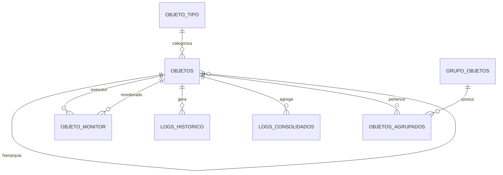

# 📘 Documentação de Arquitetura de Dados (Atualizada)

## Sistema de Gerenciamento Térmico e Energia

---

# 1. Visão Geral

Este documento descreve a arquitetura completa do banco de dados SQLite utilizado no sistema embarcado com ESP32. O modelo foi projetado para:

- Alta eficiência de escrita (IoT)
- Baixo consumo de armazenamento (MicroSD)
- Facilidade de leitura via WebServer
- Rastreabilidade completa dos dados

---

# 2. ERD (Atualizado)

---

# 3. Auditoria

Todas as tabelas possuem:

- **dt_cadastro** → data de criação
- **dt_alteracao** → última modificação

### Regras:
- INSERT → ambos automáticos
- UPDATE → atualizar dt_alteracao

---

# 4. Dicionário de Dados (Completo)

## 🔹 objeto_tipo
Define os tipos de objetos do sistema.

**Função:**
- Controlar comportamento do objeto
- Definir se possui ação ON/OFF ou valor variável

---

## 🔹 objetos
Tabela central do sistema.

**Função:**
- Representa sensores, atuadores e estruturas físicas

**Destaques:**
- Hierarquia via id_pai
- Configurações operacionais (cfg_*)

---

## 🔹 objeto_monitor
Define regras de monitoramento.

**Função:**
- Liga sensor (executor) ao objeto monitorado

---

## 🔹 logs_historico
Armazena dados brutos.

**Função:**
- Alta frequência
- Base para consolidação

---

## 🔹 logs_consolidados
Armazena dados agregados.

**Função:**
- Redução de volume
- Consultas rápidas

---

## 🔹 configuracoes
Parâmetros globais do sistema.

**Função:**
- Controle dinâmico via WebServer

---

## 🔹 grupo_objetos
Define grupos lógicos.

**Função:**
- Permitir execução em lote

Exemplo:
- Ligar refrigeração completa
- Ajustar potência geral

---

## 🔹 objetos_agrupados
Relacionamento N:N

**Função:**
- Liga objetos aos grupos

---

# 5. Fluxo de Logs

## Pipeline

logs_historico → logs_consolidados → expurgo

---

## Consolidação (30 dias)

- Calcula média, mínimo e máximo
- Move dados para logs_consolidados

---

## Expurgo (90 dias)

- Remove dados antigos
- Executa VACUUM

---

# 6. Considerações Técnicas

- Modelo otimizado para SQLite embarcado
- Redução de escrita intensiva
- Estrutura preparada para crescimento

---

# 7. Recomendações

- Criar triggers para auditoria
- Criar índices por data
- Validar duplicidade na consolidação

---

# ✔ Documento atualizado e consistente
